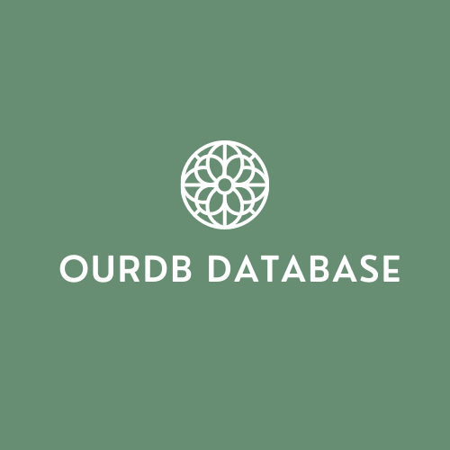

<!-- markdownlint-configure-file {
  "MD013": {
    "code_blocks": false,
    "tables": false
  },
  "MD033": false,
  "MD041": false
} -->

# OurDB database

This is documentation to [OurDatabase](https://github.com/zeelsheladiya/OurDB-Database) which is created by [Zeel Sheladiya](https://github.com/zeelsheladiya), [Mihir Surati](https://github.com/mihirsurati), [Parth Dabheliya](https://github.com/Parth-Dab).

This database is very portable, user friendly and also in this database you can make your own syntax to execute the queries. there are lot's of feature there that you can use in this database. However, the main feature is that you can connect this database with this.

## Contact
If you need any help regarding this project feel free to contact us on our [social media link]() and [github account]().

## Contribution
If you want to contribite in this then read contribution.txt

## Contributors

## License
* Inspired by the [awesome](https://github.com/sindresorhus/awesome) list.
* OurDB is licensed with MIT by  zeel sheladiya, mihir surati and parth dabheliya and contributors
